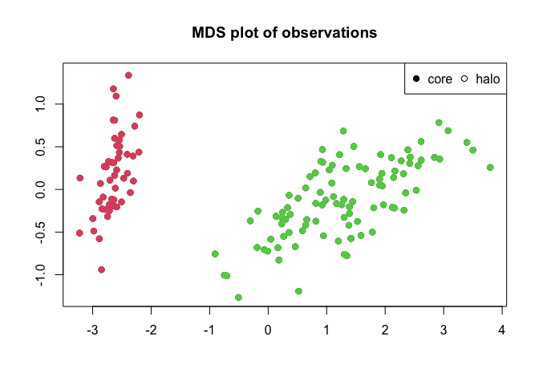

# Clustering by fast search and find of density peaks

<!-- badges: start -->

[](https://github.com/thomasp85/densityClust/actions/workflows/R-CMD-check.yaml)
[](https://app.codecov.io/gh/thomasp85/densityClust?branch=main)
[](https://CRAN.R-project.org/package=densityClust)
[](https://CRAN.R-project.org/package=densityClust)
<!-- badges: end -->

This package implement the clustering algorithm described by Alex
Rodriguez and Alessandro Laio (2014). It provides the user with tools
for generating the initial rho and delta values for each observation as
well as using these to assign observations to clusters. This is done in
two passes so the user is free to reassign observations to clusters
using a new set of rho and delta thresholds, without needing to
recalculate everything.

## Plotting

Two types of plots are supported by this package, and both mimics the
types of plots used in the publication for the algorithm. The standard
plot function produces a decision plot, with optional colouring of
cluster peaks if these are assigned. Furthermore `plotMDS()` performs a
multidimensional scaling of the distance matrix and plots this as a
scatterplot. If clusters are assigned observations are coloured
according to their assignment.

## Cluster detection

The two main functions for this package are `densityClust()` and
`findClusters()`. The former takes a distance matrix and optionally a
distance cutoff and calculates rho and delta for each observation. The
latter takes the output of `densityClust()` and make cluster assignment
for each observation based on a user defined rho and delta threshold. If
the thresholds are not specified the user is able to supply them
interactively by clicking on a decision plot.

## Usage

``` r
library(densityClust)
irisDist <- dist(iris[,1:4])
irisClust <- densityClust(irisDist, gaussian=TRUE)
#> Distance cutoff calculated to 0.2767655
plot(irisClust) # Inspect clustering attributes to define thresholds
```


``` r

irisClust <- findClusters(irisClust, rho=2, delta=2)
plotMDS(irisClust)
```



``` r
split(iris[,5], irisClust$clusters)
#> $`1`
#>  [1] setosa setosa setosa setosa setosa setosa setosa setosa setosa setosa
#> [11] setosa setosa setosa setosa setosa setosa setosa setosa setosa setosa
#> [21] setosa setosa setosa setosa setosa setosa setosa setosa setosa setosa
#> [31] setosa setosa setosa setosa setosa setosa setosa setosa setosa setosa
#> [41] setosa setosa setosa setosa setosa setosa setosa setosa setosa setosa
#> Levels: setosa versicolor virginica
#> 
#> $`2`
#>   [1] versicolor versicolor versicolor versicolor versicolor versicolor
#>   [7] versicolor versicolor versicolor versicolor versicolor versicolor
#>  [13] versicolor versicolor versicolor versicolor versicolor versicolor
#>  [19] versicolor versicolor versicolor versicolor versicolor versicolor
#>  [25] versicolor versicolor versicolor versicolor versicolor versicolor
#>  [31] versicolor versicolor versicolor versicolor versicolor versicolor
#>  [37] versicolor versicolor versicolor versicolor versicolor versicolor
#>  [43] versicolor versicolor versicolor versicolor versicolor versicolor
#>  [49] versicolor versicolor virginica  virginica  virginica  virginica 
#>  [55] virginica  virginica  virginica  virginica  virginica  virginica 
#>  [61] virginica  virginica  virginica  virginica  virginica  virginica 
#>  [67] virginica  virginica  virginica  virginica  virginica  virginica 
#>  [73] virginica  virginica  virginica  virginica  virginica  virginica 
#>  [79] virginica  virginica  virginica  virginica  virginica  virginica 
#>  [85] virginica  virginica  virginica  virginica  virginica  virginica 
#>  [91] virginica  virginica  virginica  virginica  virginica  virginica 
#>  [97] virginica  virginica  virginica  virginica 
#> Levels: setosa versicolor virginica
```

Note that while the iris dataset contains information on three different
species of iris, only two clusters are detected by the algorithm. This
is because two of the species (versicolor and virginica) are not clearly
seperated by their data.

## Refences

Rodriguez, A., & Laio, A. (2014). Clustering by fast search and find of
density peaks. Science, 344(6191), 1492-1496.
<https://doi.org/10.1126/science.1242072>
